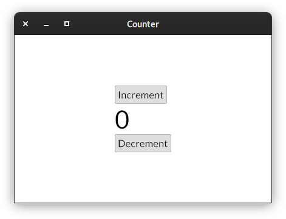

[](https://github.com/Kijewski/pyiced/actions/workflows/ci.yml)
[](https://pyiced.readthedocs.io/en/main/)
[](https://pypi.org/project/pyiced/)


[](/LICENSES/MIT.txt)

Python bindings for **[Iced](https://github.com/iced-rs/iced)**.

Iced is a cross-platform GUI library focused on simplicity and type-safety. Inspired by Elm.

## Installation

```sh
$ pip install pyiced
```

To install from source you need to have a recent version of [**Rust**](https://www.rust-lang.org/) installed in your $PATH.

[**Rustup**](https://rustup.rs/) is probably the most easy to use option to install and update [**Rust**](https://www.rust-lang.org/) on your system.


## Quick Example

[](examples/counter.py)

```py
from pyiced import (
    Align, button, ButtonState, column, container, IcedApp, Length, text,
)


class ExampleApp(IcedApp):
    def __init__(self):
        self.__incr_button_state = ButtonState()
        self.__decr_button_state = ButtonState()
        self.__value = 0

    def title(self):
        return 'Counter'

    def view(self):
        increment_button = button(
            self.__incr_button_state,  # To track the state across redraws.
            text('Increment'),         # This is content on the button.
            on_press='incr',           # This value is received in update().
        )
        value_label = text(f'{self.__value}', size=50)
        decrement_button = button(
            self.__decr_button_state,
            text('Decrement'),
            on_press='decr',
        )
        return container(
            column([
                increment_button,
                value_label,
                decrement_button,
            ]),
            padding=20, align_x=Align.CENTER, align_y=Align.CENTER,
            width=Length.FILL, height=Length.FILL,
        )

    def update(self, msg, clipboard):
        # When an event occurs, this method is called.
        # It can optionally return a list of async functions,
        # to handle the event.
        match msg:
            case 'incr':
                self.__value += 1
            case 'decr':
                self.__value -= 1


if __name__ == '__main__':
    # This function only returns if there is an error on start-up.
    # Otherwise the program gets terminated when the window is closed.
    ExampleApp().run()
```

## TODOs

* [ ] ButtonStyle != ButtonStyleSheet
* [ ] Add examples for every widget
* [x] Add a bigger example with network access, e.g. a two player game
* [ ] Implement [Canvas](https://docs.rs/iced/latest/iced/widget/canvas/struct.Canvas.html)
* [ ] Implement [PaneGrid](https://docs.rs/iced_native/latest/iced_native/widget/pane_grid/struct.PaneGrid.html)
* [ ] Add [PEP 561](https://www.python.org/dev/peps/pep-0561/) typing information
* [ ] Better documentation
* [ ] Test on MacOS
* [ ] Get to compile for musl wheels
