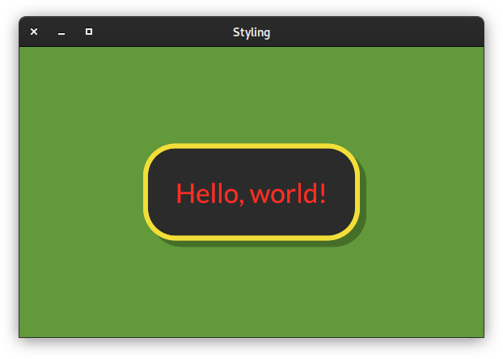

Usage Examples
==============

Quick Example
-------------

A simple counter with two buttons to increment and decrement a value:

.. image:: _static/images/examples/Counter.png
    :width: 471
    :height: 361
    :align: center
    :alt:

.. literalinclude :: ../examples/counter.py
   :language: python

Custom Styles
-------------

.. literalinclude :: ../examples/styling.py
   :language: python

Asychronous Messages
--------------------

:meth:`pyiced.IcedApp.new` and :meth:`pyiced.IcedApp.update` can either return a :class:`pyiced.Message` (or a sequence of messages in the latter case), or
`a coroutine / coroutines <https://docs.python.org/3/library/asyncio-task.html>`_
to asynchronously generate a messages.

.. image:: _static/images/examples/AsyncMessages.png
    :width: 688
    :height: 405
    :align: center
    :alt: 

.. literalinclude :: ../examples/async_messages.py
   :language: python

AsyncGenerator Generating Messages
----------------------------------

TODO

.. image:: _static/images/examples/TODO.png
    :width: 688
    :height: 405
    :align: center
    :alt: 

.. literalinclude :: ../examples/stream.py
   :language: python
