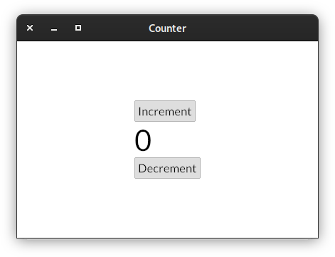
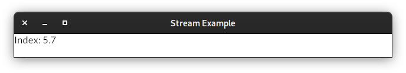

Usage Examples
==============

Quick Example
-------------

A simple counter with two buttons to increment and decrement a value:

.. literalinclude :: ../examples/counter.py
   :language: python

Custom Styles
-------------

.. image:: ../examples/widgets/button.png
    :width: 688
    :height: 405
    :align: center
    :alt: 

.. literalinclude :: ../examples/widgets/button.py
   :language: python

Asychronous Messages
--------------------

:meth:`~pyiced.IcedApp.new` and :meth:`~pyiced.IcedApp.update` can either return a :class:`~pyiced.Message`
(or a sequence of messages in the latter case), or
`a coroutine / coroutines <https://docs.python.org/3/library/asyncio-task.html>`_
to asynchronously generate a messages.

.. image:: _static/images/examples/AsyncMessages.png
    :width: 688
    :height: 405
    :align: center
    :alt: 

.. literalinclude :: ../examples/async_messages.py
   :language: python

AsyncGenerator Generating Messages
----------------------------------

An application can :meth:`subscribe <pyiced.IcedApp.subscriptions>` to :class:`~typing.AsyncGenerator`\ s
to receive :class:`~pyiced.Message`\ s about asynchronously generated information, e.g. a pending web download.

.. literalinclude :: ../examples/stream.py
   :language: python

Capturing Keystrokes
--------------------

To capture any keystoke (or indeed any event that original from user interaction),
you can make :meth:`pyiced.IcedApp.subscriptions()` return a list
\[\ :data:`pyced.Subscription.UNCAPTURED <pyiced.Subscription.UNCAPTURED>`].

.. literalinclude :: ../examples/fullscreen.py
   :language: python
