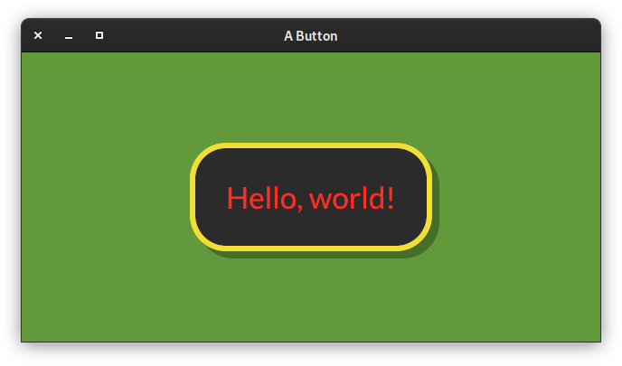

Element Styles
==============

Overview
--------

.. autosummary::
   ~pyiced.ButtonStyle
   ~pyiced.ButtonStyleSheet
   ~pyiced.CheckboxStyle
   ~pyiced.CheckboxStyleSheet
   ~pyiced.ContainerStyle
   ~pyiced.ContainerStyleSheet
   ~pyiced.PaneGridStyle
   ~pyiced.PaneGridStyleSheet
   ~pyiced.PickListMenu
   ~pyiced.PickListStyle
   ~pyiced.PickListStyleSheet
   ~pyiced.ProgressBarStyle
   ~pyiced.ProgressBarStyleSheet
   ~pyiced.RadioStyle
   ~pyiced.RadioStyleSheet
   ~pyiced.RuleStyle
   ~pyiced.RuleStyleSheet
   ~pyiced.ScrollableStyleSheet
   ~pyiced.ScrollbarStyle
   ~pyiced.ScrollerStyle
   ~pyiced.SliderStyle
   ~pyiced.SliderStyleSheet
   ~pyiced.TextInputStyle
   ~pyiced.TextInputStyleSheet

Quick Example
-------------

.. literalinclude :: ../examples/widgets/button.py
   :language: python

Details
-------

.. autoclass:: pyiced.ButtonStyle

.. autoclass:: pyiced.ButtonStyleSheet
   :members:
   :undoc-members:

.. autoclass:: pyiced.CheckboxStyle
   :members:
   :undoc-members:

.. autoclass:: pyiced.CheckboxStyleSheet
   :members:
   :undoc-members:

.. autoclass:: pyiced.ContainerStyle

.. autoclass:: pyiced.ContainerStyleSheet
   :members:
   :undoc-members:

.. autoclass:: pyiced.PaneGridStyle

.. autoclass:: pyiced.PaneGridStyleSheet
   :members:
   :undoc-members:

.. autoclass:: pyiced.PickListMenu
   :members:
   :undoc-members:

.. autoclass:: pyiced.PickListStyle
   :members:
   :undoc-members:

.. autoclass:: pyiced.PickListStyleSheet
   :members:
   :undoc-members:

.. autoclass:: pyiced.ProgressBarStyle

.. autoclass:: pyiced.ProgressBarStyleSheet
   :members:
   :undoc-members:

.. autoclass:: pyiced.RadioStyle
   :members:
   :undoc-members:

.. autoclass:: pyiced.RadioStyleSheet
   :members:
   :undoc-members:

.. autoclass:: pyiced.RuleStyle
   :members:
   :undoc-members:

.. autoclass:: pyiced.RuleStyleSheet
   :members:
   :undoc-members:

.. autoclass:: pyiced.ScrollableStyleSheet
   :members:
   :undoc-members:

.. autoclass:: pyiced.ScrollbarStyle
   :members:
   :undoc-members:

.. autoclass:: pyiced.ScrollerStyle
   :members:
   :undoc-members:

.. autoclass:: pyiced.SliderStyle
   :members:
   :undoc-members:

.. autoclass:: pyiced.SliderStyleSheet
   :members:
   :undoc-members:

.. autoclass:: pyiced.TextInputStyle
   :members:
   :undoc-members:

.. autoclass:: pyiced.TextInputStyleSheet
   :members:
   :undoc-members:
